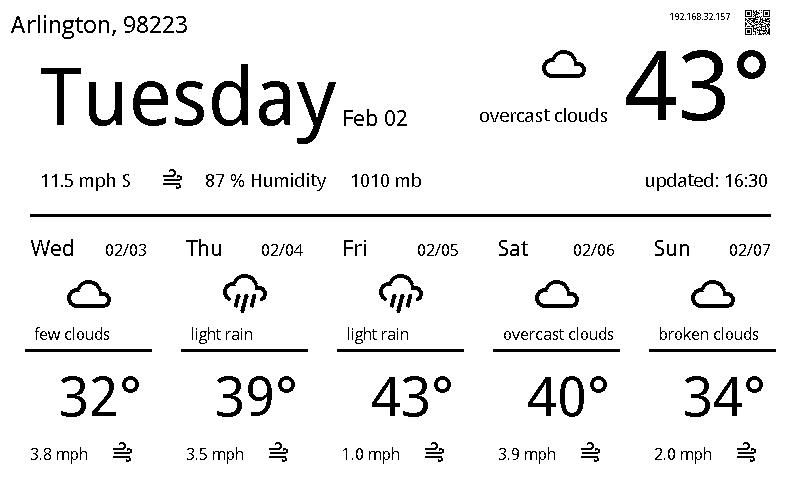

## Forecast

Forecast is a python3 script to display a weather dashboard on a Waveshare e-paper display.



### Setup

This script uses weather data from the openweathermap.org API. You will need to sign up for a free account and obtain an API key. This key
needs to be exported as the environment variable OPEN_WEATHER_MAP_API_KEY. 

The Waveshare panel and their python driver works Raspberry Pi single board computers. I'm running this script on a Raspberry Pi 0 W and it works nicely.

Install Raspberry Pi OS on an SD card and boot your pi with that SD card. You will need to do a few things at the OS level to enable the SPI bus, connect
to your WIFI, enable SSH, and disable the default desktop GUI. Those topics are covered on the Raspberry Pi OS download page referenced below.

The Waveshare drivers are included in this repository in the lib folder. You can upgrade to newer drivers as they are released by copying the python files into the lib folder. The Waveshare wiki is also linked below for more information on the e-paper panel

<https://www.raspberrypi.org/software/>

<https://www.waveshare.com/wiki/7.5inch_e-Paper_HAT>

<https://github.com/waveshare/e-Paper>

#### Python Libs

Install python library requirements with pip

```
python3 -m pip install -r requirements.txt
```

#### Evironment Variables

Create a `.env` file in the project directory that contains the API key(s) and zipcode as environment variables. If you want to use the Ambient Weather integration, you need to create an account with Ambient and also create an API key and app key. You also need to get the MAC address off of your device and enter it here.

```
export OPEN_WEATHER_MAP_API_KEY="<your key>"
export WEATHER_ZIP_CODE=<your_zip>
export AMBIENT_API_KEY=<your_key>
export AMBIENT_APP_KEY=<your_key>
export AMBIENT_DEVICE_MAC=<your_device_MAC_ID>
```

This file will be sourced in crontab to specify secrets and config data for forecast.py.

#### Crontab Entry

In order to update the display periodically, we will use linux's crontab. Edit your user's crontab file with `crontab -e`. Add the following
line to your crontab:

```
*/15 * * * * . /home/pi/forecast/.env; cd /home/pi/forecast/www; /home/pi/forecast/forecast.py >> /home/pi/forecast/forecast.log 2>&1
```

Adjust as necessary to account for where you have located the forecast script repo. This entry will run the script every 15 minutes. Make
sure that you include a blank line at the end of the crontab file, else your job will fail to run and you will be left wondering why.

## Web Display

If you would like to view your e-paper display contents from the web then run this NGINX container on your pi.

```
docker run --name forecast-nginx -v /home/pi/forecast/www:/usr/share/nginx/html:ro -d -p 80:80 nginx:alpine
```

To install docker on your pi, the easiest way is to use get.docker.com.

```
sudo curl -sL get.docker.com | bash
```


