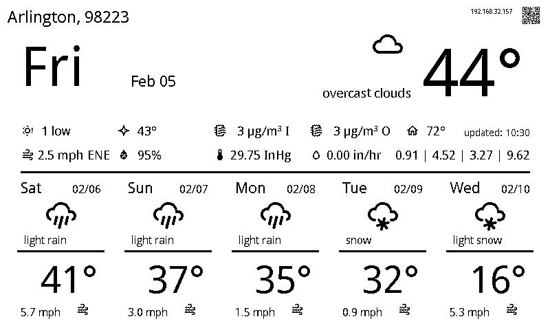

## Forecast

Forecast is a python3 script to display a weather dashboard on a Waveshare e-paper display.



### Setup

#### Python Libs

Install python library requirements with pip

```
python3 -m pip installl -r requirements.txt
```

#### Evironment Variables

Create a `.env` file in the project directory that contains the API key and zipcode as environment variables.

```
export OPEN_WEATHER_MAP_API_KEY="<your key>"
export WEATHER_ZIP_CODE=<your_zip>
```

This file will be sourced in crontab to specify secrets and config data for forecast.py.

#### Crontab Entry

In order to update the display periodically, we will use linux's crontab. Edit your user's crontab file with `crontab -e`. Add the following
line to your crontab:

```
*/15 * * * * . /home/pi/forecast/.env; /home/pi/forecast/forecast.py >> /home/pi/forecast/forecast.log 2>&1
```

Adjust as necessary to account for where you have located the forecast script repo. This entry will run the script every 15 minutes.

